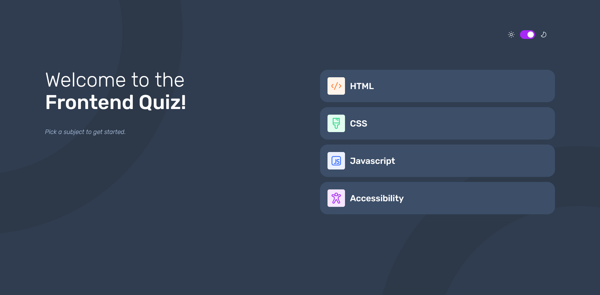
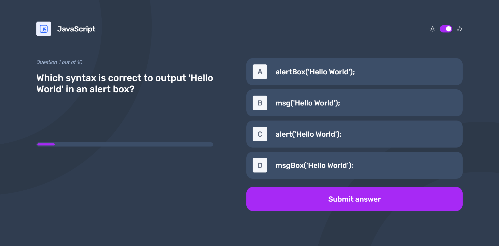
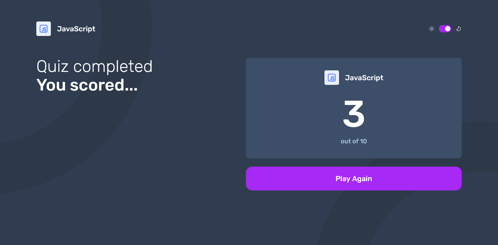

# Frontend Mentor - Frontend quiz app solution

This is a solution to the [Frontend quiz app challenge on Frontend Mentor](https://www.frontendmentor.io/challenges/frontend-quiz-app-BE7xkzXQnU).

## Table of contents

- [Overview](#overview)
  - [The challenge](#the-challenge)
  - [Screenshot](#screenshot)
  - [Links](#links)
- [My process](#my-process)
  - [Built with](#built-with)
  - [What I learned](#what-i-learned)
  - [Continued development](#continued-development)
- [Author](#author)

## Overview

### The challenge

Users should be able to:

- Select a quiz subject
- Select a single answer from each question from a choice of four
- See an error message when trying to submit an answer without making a selection
- See if they have made a correct or incorrect choice when they submit an answer
- Move on to the next question after seeing the question result
- See a completed state with the score after the final question
- Play again to choose another subject
- View the optimal layout for the interface depending on their device's screen size
- See hover and focus states for all interactive elements on the page
- Navigate the entire app only using their keyboard
- Change the app's theme between light and dark

### Screenshot

### Links

- Solution URL: [Solution](https://www.frontendmentor.io/solutions/resposive-frontend-quiz-app-oaUU-6mABV)
- Live Site URL: [Live Site](https://blessyoumate.github.io/frontend-quiz-app-fm/)

## My process

### Built with

- Semantic HTML5 markup
- CSS custom properties
- Flexbox
- CSS Grid
- Mobile-first workflow

### What I learned

This was one of the biggest applications I have built so far, so I learned a lot. The most important lesson was managing a larger application with a design system. I spent a good chunk of time creating typography classes and CSS variables. I also significantly improved my JavaScript skills during this project.

### Continued development

In the future, I want to build more complex projects like this one. However, I want to be more consistent with my work routine because this project took me twice as long as I expected.

## Author

- Github - [Wiktor Jasiak](https://github.com/BlessYouMate)
- Frontend Mentor - [@BlessYouMate](https://www.frontendmentor.io/profile/BlessYouMate)

